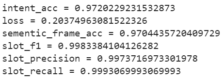

##### Result on test set



##### Download model at [here](https://drive.google.com/drive/folders/1-AH7yrtYpxspNHFh8JqIu7mYKBekMRKU?usp=sharing)

##### Usage inference 
```python inference.py --model "./phobert" --input_text "khi nào tôi được điều trị"```

```[{'intent': 'treatment', 'prop': array([-0.5694828, -1.1454507, -0.8730541, -1.4029516, -1.007271, 13.4075, -0.57104, -1.4170461, -1.4651579], dtype=float32), 'entities': ['O', 'O', 'O', 'O', 'O', 'O']}]```

##### At present, the model is trained with 8 intents, that is described in *intent_label.txt* and entities in *slot_label.txt*